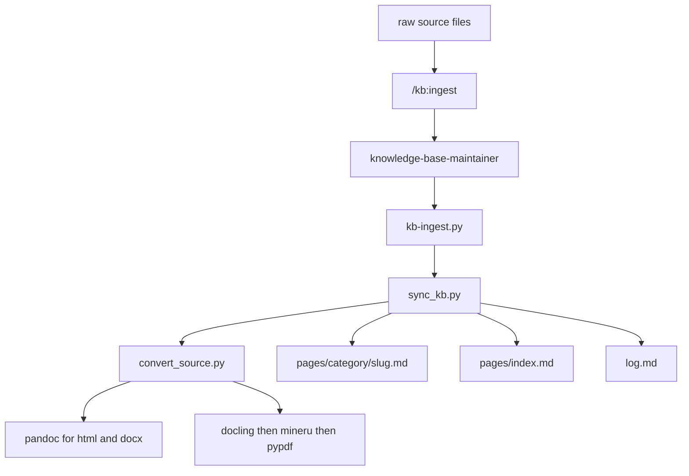
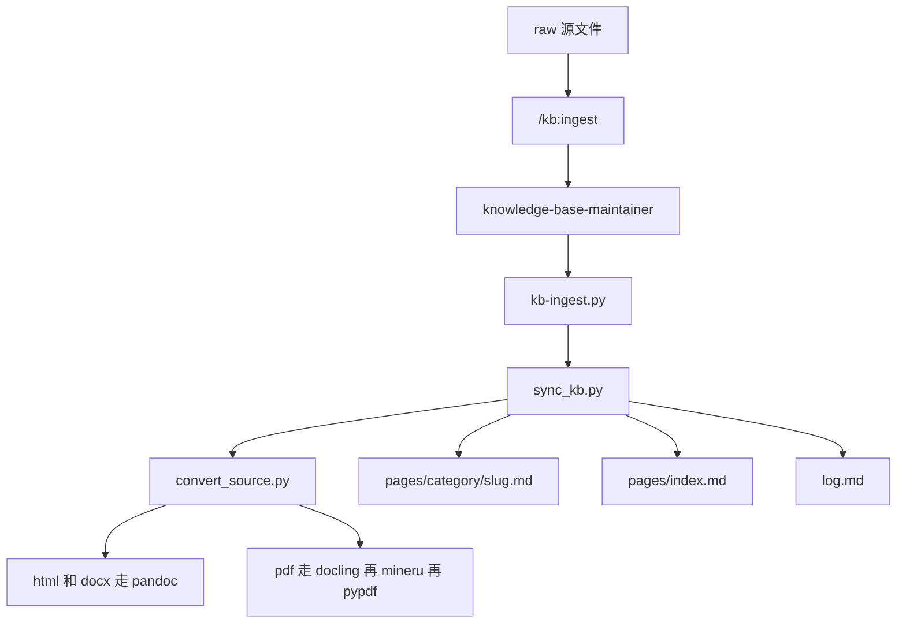

# wiki-knowledge-base-skill

Build and maintain a local obsidian knowledge base with based on Karpathy's LLM Wiki.

## English

### Install

#### Codex

Clone the whole repository, expose `skills/` to Codex skill discovery, then restart Codex.

```bash
git clone https://github.com/Playitcooool/wiki-knowledge-base-skill.git ~/.codex/vendor_imports/wiki-knowledge-base-skill
mkdir -p ~/.agents/skills/wiki-knowledge-base
ln -s ~/.codex/vendor_imports/wiki-knowledge-base-skill/skills ~/.agents/skills/wiki-knowledge-base/skills
```

#### Claude Code

Local plugin directory:

```bash
claude --plugin-dir /path/to/wiki-knowledge-base-skill
```

Local or self-hosted marketplace:

```text
/plugin marketplace add /path/to/wiki-knowledge-base-skill
```

After publishing:

```text
/plugin marketplace add https://github.com/Playitcooool/wiki-knowledge-base-skill
/plugin install kb@knowledge-base
```

#### Cursor

For local testing, install the repository as a local Cursor plugin. The plugin is not published in Cursor Marketplace yet.

```bash
git clone https://github.com/Playitcooool/wiki-knowledge-base-skill.git ~/src/wiki-knowledge-base-skill
mkdir -p ~/.cursor/plugins/local
ln -s ~/src/wiki-knowledge-base-skill ~/.cursor/plugins/local/kb
```

Then reload Cursor and use:

```text
/kb:ingest
```

### Use

Use:

```text
/kb:ingest
```

Typical intents:

```text
/kb:ingest preview this folder first
/kb:ingest bootstrap this folder and build the knowledge base
/kb:ingest update pages/ from raw/
/kb:ingest check whether PDF conversion is ready
```

Behavior:

- Always check what would change first
- Auto-apply when the check is clean
- Ask before risky writes, especially delete operations
- Dependency question: run doctor logic
- Greenfield folder: initialize `raw/`, `pages/`, `pages/index.md`, and `log.md` when needed

The model can also infer this skill from user intent even without the explicit slash command, but `/kb:ingest` is the clearest path.You can check the graph in obsidian.

For direct local execution from this repository, run:

```bash
python3 skills/knowledge-base-maintainer/scripts/doctor.py
python3 skills/knowledge-base-maintainer/scripts/kb-ingest.py --root .
python3 skills/knowledge-base-maintainer/scripts/kb-ingest.py --root . --apply
```

### Dependencies

- Out of the box: `md`, `txt`
- Requires `pandoc`: `html`, `docx`
- Basic PDF fallback:

```bash
pip install -r skills/knowledge-base-maintainer/requirements.txt
```

- Enhanced PDF and OCR:

```bash
pip install -r skills/knowledge-base-maintainer/requirements-optional.txt
```

Conversion path:

- HTML and DOCX: `pandoc`
- PDF: `docling -> mineru -> pypdf`

### Page Categories

Generated pages are written under `pages/` with one primary category:

- `research`: papers, reports, technical investigations, experiment writeups
- `guides`: explainers, comparisons, tool docs, workflow guides
- `notes`: reading notes, informal notes, meeting notes, or anything still to be confirmed

If classification is unclear, the system falls back to `notes`.

### Architecture

Architecture inspiration: [Andrej Karpathy, LLM Wiki](https://gist.github.com/karpathy/442a6bf555914893e9891c11519de94f)



## 中文

### 安装

#### Codex

建议直接按整仓安装。克隆仓库后，把 `skills/` 暴露给 Codex 的 skill discovery，然后重启 Codex。

```bash
git clone https://github.com/Playitcooool/wiki-knowledge-base-skill.git ~/.codex/vendor_imports/wiki-knowledge-base-skill
mkdir -p ~/.agents/skills/wiki-knowledge-base
ln -s ~/.codex/vendor_imports/wiki-knowledge-base-skill/skills ~/.agents/skills/wiki-knowledge-base/skills
```

#### Claude Code

本地 plugin 目录方式：

```bash
claude --plugin-dir /path/to/wiki-knowledge-base-skill
```

本地或自托管 marketplace：

```text
/plugin marketplace add /path/to/wiki-knowledge-base-skill
```

发布后也可以直接从 GitHub 安装：

```text
/plugin marketplace add https://github.com/Playitcooool/wiki-knowledge-base-skill
/plugin install kb@knowledge-base
```

#### Cursor

如果是本地测试，把仓库作为本地 Cursor plugin 安装。当前还没有发布到 Cursor Marketplace。

```bash
git clone https://github.com/Playitcooool/wiki-knowledge-base-skill.git ~/src/wiki-knowledge-base-skill
mkdir -p ~/.cursor/plugins/local
ln -s ~/src/wiki-knowledge-base-skill ~/.cursor/plugins/local/kb
```

然后重载 Cursor，统一入口仍然是：

```text
/kb:ingest
```

### 使用

统一入口是：

```text
/kb:ingest
```

典型调用：

```text
/kb:ingest 先预检当前文件夹
/kb:ingest 初始化当前目录并构建知识库
/kb:ingest 根据 raw/ 更新 pages/
/kb:ingest 检查 PDF 转换依赖是否就绪
```

行为规则：

- 始终先检查会发生什么变化
- 检查结果干净时自动 apply
- 遇到高风险写入，尤其是 delete 时先询问用户
- 用户在问依赖或转换能力时：先走 doctor 逻辑
- 绿地目录下：按需初始化 `raw/`、`pages/`、`pages/index.md`、`log.md`

即使用户不显式输入 `/kb:ingest`，模型也可以根据意图命中这个 skill，但显式命令最稳定。
完成之后可以在obsidian看到节点之间的依赖关系。

如果你是在这个仓库里直接运行脚本，请使用：

```bash
python3 skills/knowledge-base-maintainer/scripts/doctor.py
python3 skills/knowledge-base-maintainer/scripts/kb-ingest.py --root .
python3 skills/knowledge-base-maintainer/scripts/kb-ingest.py --root . --apply
```

### 依赖

- 开箱可用：`md`、`txt`
- 需要 `pandoc`：`html`、`docx`
- 基础 PDF fallback：

```bash
pip install -r skills/knowledge-base-maintainer/requirements.txt
```

- 增强 PDF 和 OCR：

```bash
pip install -r skills/knowledge-base-maintainer/requirements-optional.txt
```

转换链路：

- HTML / DOCX：`pandoc`
- PDF：`docling -> mineru -> pypdf`

### 页面分类

生成后的页面会写入 `pages/`，并且只归入一个主分类：

- `research`：论文、报告、技术调研、实验记录
- `guides`：解释文、对比文、工具文档、工作流指南
- `notes`：读书笔记、零散笔记、会议记录，或者暂时无法确认分类的内容

如果分类不明确，系统会默认回落到 `notes`。

### 架构

架构参考：[Andrej Karpathy, LLM Wiki](https://gist.github.com/karpathy/442a6bf555914893e9891c11519de94f)



## License

MIT. See [LICENSE](LICENSE).
