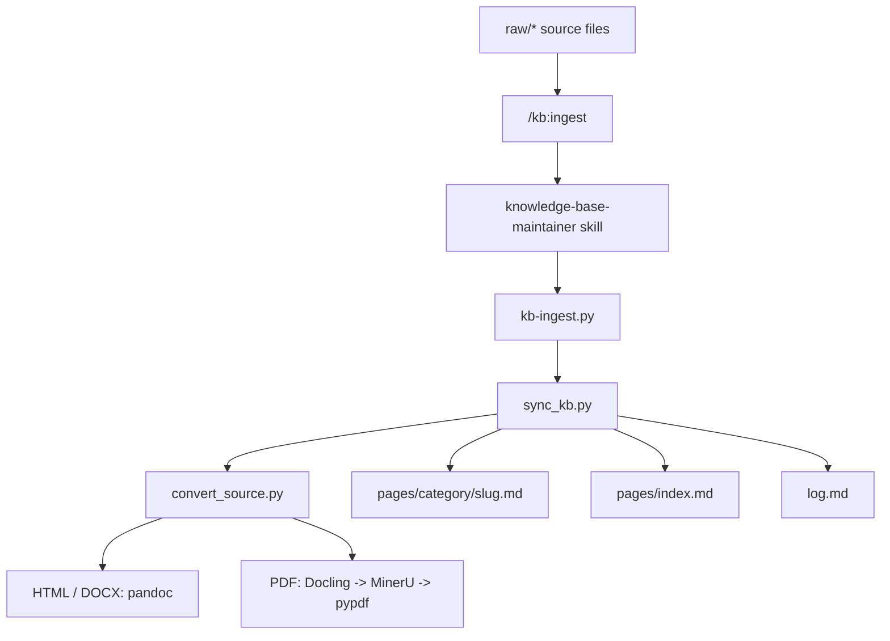

# Knowledge Base Maintainer

Self-contained knowledge-base toolkit for Codex / Claude Code.  
面向 Codex / Claude Code 的本地知识库构建与增量更新工具包。

## Usage

In Codex / Claude Code, use:

- `/kb:ingest`
  Single entrypoint for bootstrap, preview, update, and dependency checking.  
  一个统一入口，内部处理初始化、预检、更新和依赖检查。

Example intents:

```text
/kb:ingest preview this folder first
/kb:ingest bootstrap this folder and build the knowledge base
/kb:ingest update pages/ from raw/
/kb:ingest check whether PDF conversion is ready
```

Behavior:

- Preview / inspect / review intent: dry-run first
- Build / update / sync intent: apply changes
- Dependency / readiness intent: run doctor logic
- Greenfield folder: initialize `raw/`, `pages/`, `pages/index.md`, `log.md` when needed

## Install

### Plugin

Recommended if you want the explicit slash command `/kb:ingest`.

Repo-local plugin:

```bash
# keep the repo structure as-is
plugins/kb
.agents/plugins/marketplace.json
```

Home-local plugin:

```bash
mkdir -p ~/plugins
cp -R plugins/kb ~/plugins/kb
mkdir -p ~/.agents/plugins
```

Then add this entry to `~/.agents/plugins/marketplace.json`:

```json
{
  "name": "kb",
  "source": {
    "source": "local",
    "path": "./plugins/kb"
  },
  "policy": {
    "installation": "AVAILABLE",
    "authentication": "ON_INSTALL"
  },
  "category": "Productivity"
}
```

### Skill Only

Use this if you want the underlying skill without the plugin command layer.

```bash
mkdir -p ~/.codex/skills
cp -R skills/knowledge-base-maintainer ~/.codex/skills/knowledge-base-maintainer
```

Then invoke it from Codex with the installed skill name.

## Dependencies

- Out of the box: `md` / `txt`
- Requires `pandoc`: `html` / `docx`
- Minimal Python install for basic PDF fallback:

```bash
pip install -r skills/knowledge-base-maintainer/requirements.txt
```

- Optional enhanced PDF/OCR install:

```bash
pip install -r skills/knowledge-base-maintainer/requirements-optional.txt
```

Conversion path:

- HTML / DOCX: `pandoc`
- PDF: `docling -> mineru -> pypdf`

## Architecture

[Architecture inspiration: Andrej Karpathy, *LLM Wiki*](https://gist.github.com/karpathy/442a6bf555914893e9891c11519de94f)



## Packaging

- Standalone skill: [`skills/knowledge-base-maintainer`](skills/knowledge-base-maintainer)
- Explicit command plugin: [`plugins/kb`](plugins/kb)
- Local marketplace entry: [`.agents/plugins/marketplace.json`](.agents/plugins/marketplace.json)

The plugin bundles the same skill so slash commands can explicitly invoke it.  
plugin 内置同一份 skill，用于提供显式 slash command 入口。

## Runtime

- Git-ignored runtime data: `raw/`, `pages/`, `log.md`
- Generated global index path: `pages/index.md`
- Default ingest behavior: dry-run first, `--apply` to write

## License

MIT. See [LICENSE](LICENSE).
