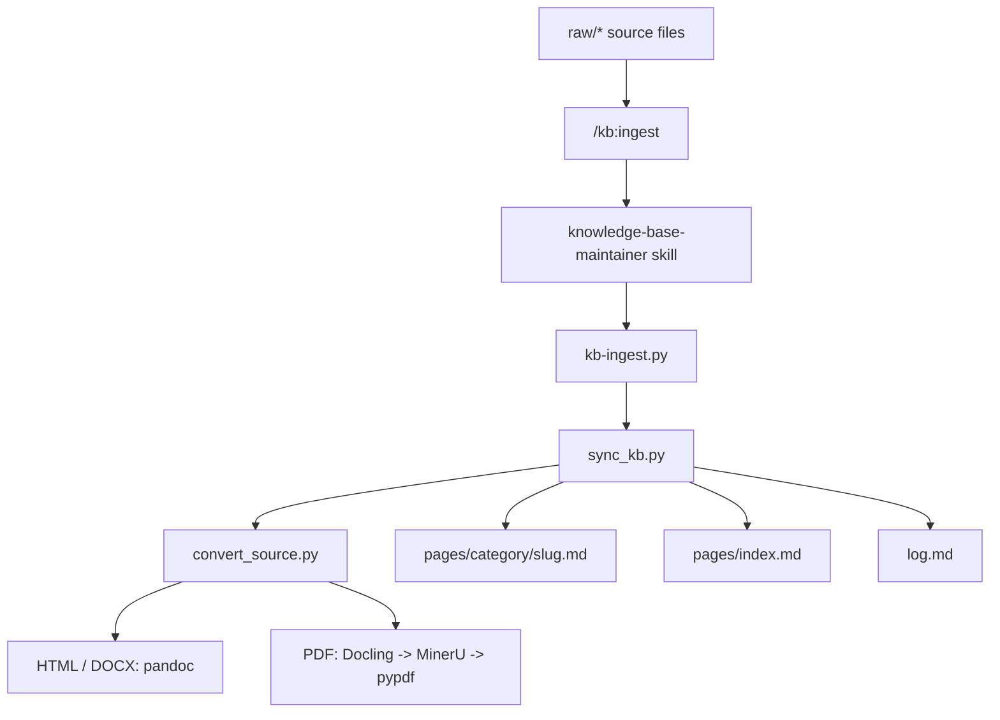

# Knowledge Base Maintainer

Self-contained knowledge-base toolkit for Codex / Claude Code.  
面向 Codex / Claude Code 的本地知识库构建与增量更新工具包。

## Install

No official certification is required.

- Codex can use this repository as a whole-repo capability bundle.
- Claude Code can use it as a local plugin or through a self-hosted marketplace.

### Codex

Clone the whole repo, then expose `skills/` to Codex native discovery.

```bash
git clone https://github.com/Playitcooool/wiki-knowledge-base-skill.git ~/.codex/vendor_imports/wiki-knowledge-base-skill
mkdir -p ~/.agents/skills/wiki-knowledge-base
ln -s ~/.codex/vendor_imports/wiki-knowledge-base-skill/skills ~/.agents/skills/wiki-knowledge-base/skills
```

Then restart Codex.

Whole-repo install docs: [INSTALL.md](/Volumes/Samsung/Projects/knowledge-base/.codex/INSTALL.md)

If your Codex build supports local plugin packages, the repository root also includes:

- [plugin.json](/Volumes/Samsung/Projects/knowledge-base/.codex-plugin/plugin.json)
- [commands](/Volumes/Samsung/Projects/knowledge-base/commands)

That is the slash-command layer for `/kb:ingest`.

### Claude Code

Local session plugin:

```bash
claude --plugin-dir /path/to/wiki-knowledge-base-skill
```

Local or self-hosted marketplace:

```text
/plugin marketplace add /path/to/wiki-knowledge-base-skill
```

Or, after publishing:

```text
/plugin marketplace add https://github.com/Playitcooool/wiki-knowledge-base-skill
/plugin install kb@knowledge-base
```

Claude marketplace files live at:

- [plugin.json](/Volumes/Samsung/Projects/knowledge-base/.claude-plugin/plugin.json)
- [marketplace.json](/Volumes/Samsung/Projects/knowledge-base/.claude-plugin/marketplace.json)

## Usage

In Codex / Claude Code, use:

- `/kb:ingest`
  Single entrypoint for bootstrap, preview, update, and dependency checking.  
  一个统一入口，内部处理初始化、预检、更新和依赖检查。

Example intents:

```text
/kb:ingest preview this folder first
/kb:ingest bootstrap this folder and build the knowledge base
/kb:ingest update pages/ from raw/
/kb:ingest check whether PDF conversion is ready
```

Behavior:

- Preview / inspect / review intent: dry-run first
- Build / update / sync intent: apply changes
- Dependency / readiness intent: run doctor logic
- Greenfield folder: initialize `raw/`, `pages/`, `pages/index.md`, `log.md` when needed

## Dependencies

- Out of the box: `md` / `txt`
- Requires `pandoc`: `html` / `docx`
- Minimal Python install for basic PDF fallback:

```bash
pip install -r skills/knowledge-base-maintainer/requirements.txt
```

- Optional enhanced PDF/OCR install:

```bash
pip install -r skills/knowledge-base-maintainer/requirements-optional.txt
```

Conversion path:

- HTML / DOCX: `pandoc`
- PDF: `docling -> mineru -> pypdf`

## Architecture

[Architecture inspiration: Andrej Karpathy, *LLM Wiki*](https://gist.github.com/karpathy/442a6bf555914893e9891c11519de94f)



## Packaging

- Root Codex package: [plugin.json](/Volumes/Samsung/Projects/knowledge-base/.codex-plugin/plugin.json)
- Root Claude package: [plugin.json](/Volumes/Samsung/Projects/knowledge-base/.claude-plugin/plugin.json)
- Root slash commands: [commands](/Volumes/Samsung/Projects/knowledge-base/commands)
- Standalone skill: [`skills/knowledge-base-maintainer`](skills/knowledge-base-maintainer)
- Legacy nested Codex plugin: [`plugins/kb`](plugins/kb)

## Runtime

- Git-ignored runtime data: `raw/`, `pages/`, `log.md`
- Generated global index path: `pages/index.md`
- Default ingest behavior: dry-run first, `--apply` to write

## License

MIT. See [LICENSE](LICENSE).
